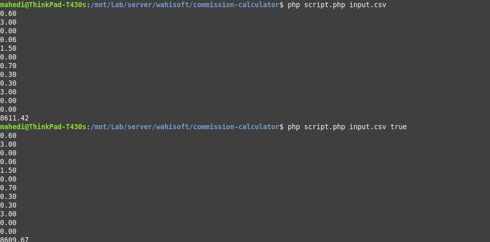
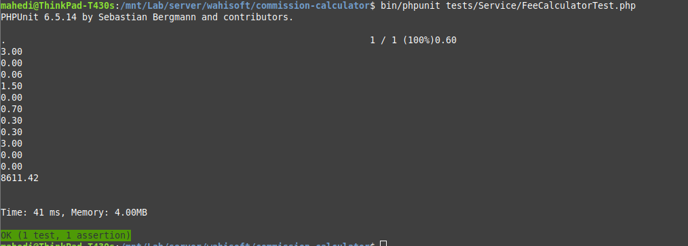

# Commission calculator

## Run with terminal
* To install composer follow command: install composer

* To run with php follow command
  * Default exchange rate in php: script.php input.csv
  * With realtime exchange rate api in php: script.php input.csv true
   
    

* To unit test run command:  bin/phpunit tests/Service/FeeCalculatorTest.php

    

 ## Hints
 * For the rule currency convert operation using rates provided by [api.exchangeratesapi.io](https://api.exchangeratesapi.io/latest).
 * Input data in input.csv file

